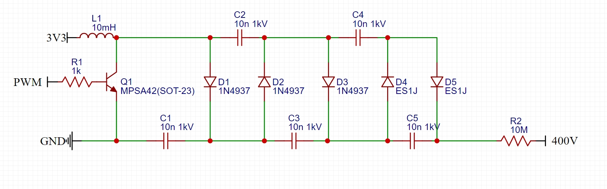
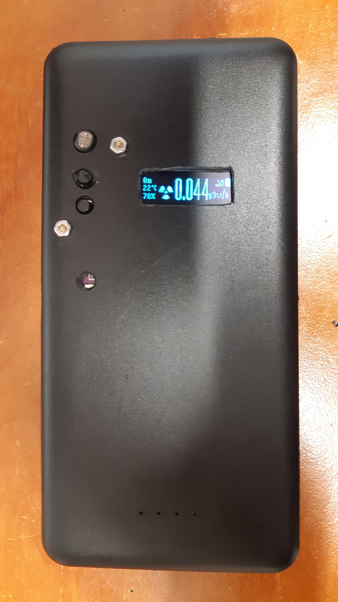
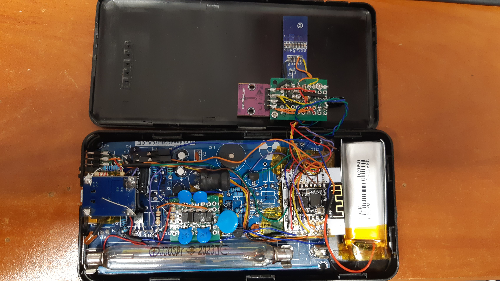
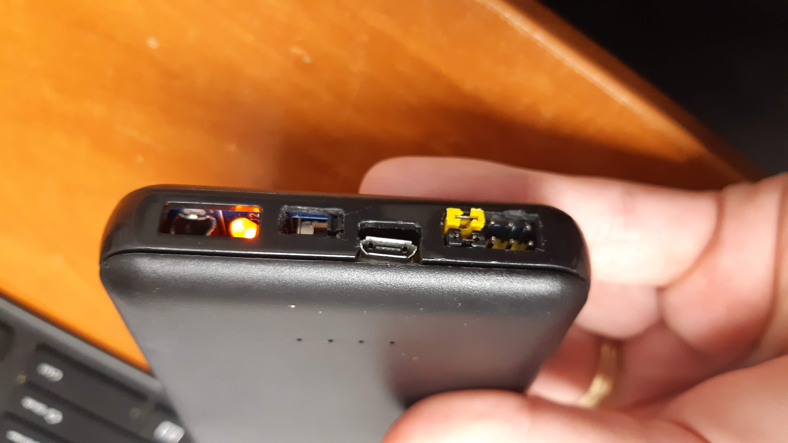

# Geiger-Muller-Counter-Dosimeter
Geiger-Müller Counter / Dosimeter whit ESPHOME and CAJOE module

Zariadenie slúžiace na meranie rádioaktivity vo vzduchu v rozsahu Beta a Gamma žiarenia

Zariadenie s podporou ESPHOME integrovane do Home Assitentu

Funkcie:
- Meranie Gamma a Beta žiarenia v jednotkách µSv/h
- Meranie Gamma a Beta žiarenia v čase v jednotkách µSv
- Meranie CPM (count per minute)
- Meranie Teploty/Vlhkosti/Tlaku
- Meranie jasu pomocou LDR a následná úprava jasu displeja

- Upozornenie na zvýšenú rádioaktivitu pomocou ikony na displeji
- Ukazovateľ stavu báterie/pripojenia/hlasitosti/pripojenia nabíjania pomocou USB
- Plne funkčne na batérii (doba chodu cca 2 mesiace - podľa intervalu aktualizácie 1h)
- Nabíjanie pomocou USB
- Vipnutie Sleep módu/Zvuku pomocou jumperov
- Tlačidlá pre reset/ovladanie zapnutia displeja/hlasitosti zvuku/alebo prechod do sleep modu
- Vipnutie v HA rozhraní meranie radioaktivity/meranie jasu/I2C zariadení

Potrebný Hardwér:
- Krabička z 10000mAh power banky (alebo iná)
- RadiationD-v1.1 (CAJOE) modul
- Gaiger tube J305/J321/M4011 (osadená J305)
- ESP8266 ESP-12F + adaptér
- oled displej 128x32
- AHT20
- LED 2,0mm oranžová + 1kohm rezistor
- LDR 5516 + 10k + kondenzátor
- Batéria 3.7V 1000mAh s BMS + nabíjací modul TP4056
- Push button 2x 3.1mm
- LDO regulátor HT7833

- Odpory
- Usmerňovacie diody ES1J
- Kondenzátory keramické 10n 1kV
- Piny zahnuté + hroty + káble
- Kondenzátor fóliový 470uF
- N-channal mosfet 2N7000
- NPN - tranzotor 2N3904
- poistky PPTC

Úpravy HW:
Radiation modul:
- Samotná doska má mnoho úprav predovšetkým z dôvodu umiestnenia do malej krabičky najdôležitejšia úrpava je ale zosilnovač napätia podľa schémy nižšie:

  odstranuje sa (R1, R2, C5, R5, Q1) a R4 je nahradene za 1kohm rezistor
  

- ďalej odstránenie komplet audio jacku a príslušenstva k nemu (R32, P100, R34, U80B, U110)
- Odstránenie NE555 pre vytv=aranie pípnutia (R20, C22, IC2, C66, J1, R23, D23) tento zvuk bude vytvárať samotne ESP
- Odstranený indikator pripojenia led
- R100 je zamenený za 1ohm rezistor
- Odstránený test point a všetky odpory

ESP8266:
- zmena Quad flash na DIO flash.
  Zdroj: http://smarpl.com/content/esp8266-esp-201-module-freeing-gpio9-and-gpio10

Displej:
- Odstránený regulátor 662k

Nabíjačka TP4056
- Rezistor prog: 2,2kohm = 545mA nabíjanie
- Current limiter R400 za PPTC poistku
- + divider pre indikaciu nabíjania pripojenia USB 68k + 100kohm rezistory

Software:
Všetko potrebné v YAML súbore. Zdrojový kód som sa snažil doplniť o všetko potrebné čo treba vedieť od HW úprav až po výpočet spŕavneho určenia radiácie. 
Doporučujem prebehnuť celý kód

Prevedenie:

